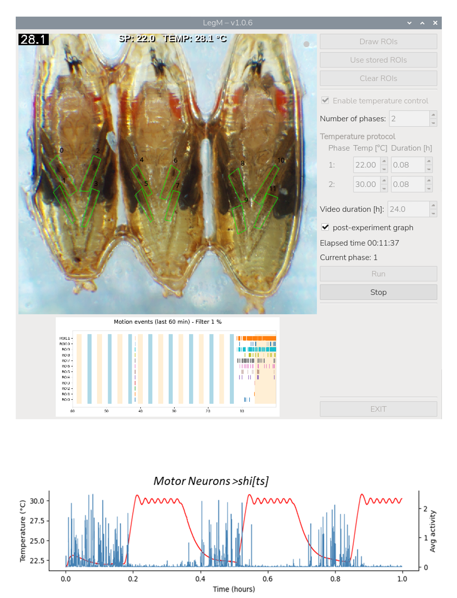

# LegMonitor
Scripts for monitoring leg movements in Drosophila pupae

<p align="center">
  
</p>

# LegM: Pupal Movement Monitor

LegM is a Python-based system for the Raspberry Pi designed to record high-resolution video of pupae while simultaneously cycling temperature and detecting movement in real-time.

## 1. Hardware Connections
To use the thermal control features, connect your hardware to the Raspberry Pi according to these pins:

|Component  |Physical Pin #	  |BCM (GPIO) #	  |Notes|
|-----------|-----------------|---------------|-----|
|Relay Signal | Pin 29 | GPIO 5 | Controls the heating element  |
|DS18B20 Sensor | Pin 7 | GPIO 4 | 1-Wire Data (Requires a 4.7kΩ pull-up resistor)  |

________________________________________

## 2. Simple Installation (The Quick Way)  
1.	Transfer the LegM folder to your user folder in the Raspberry Pi.
2.	Open a terminal and get into LegM folder
your_user_name@raspberrypi:~S cd LegM
3.	Run the installer typing:
```
bash LegM_installation.sh
```
alternatively, make it executable and then run it  
``` 
chmod +x LegM_installation.sh
```
and then  
```
./LegM_installation.sh
```

4.	**Reboot** your Raspberry Pi.
5.	Double-click the LegM icon on your desktop to start.
6.	Stop the "Execute or Open" prompt:  
By default, Raspberry Pi OS asks what to do when you click a script. To make it open immediately:
    - Open the File Manager.
    - Go to Edit -> Preferences.
    - Go to the General tab.
    - Check the box: "Don't ask options on launch executable file".
________________________________________
## 3. Detailed explanation of the installation process

The installer is designed to automate the configuration of a Raspberry Pi. It handles hardware protocols, system libraries, and software isolation.  

### 3.1.	Hardware Configuration (1-Wire Protocol)
The first priority of the script is to enable the **1-Wire interface**, which the DS18B20 temperature sensor requires to communicate. The installation process details are saved in the install.log file.  
- **Detection**: The script checks if dtoverlay=w1-gpio is present in /boot/firmware/config.txt.
- **Modification**: If missing, it appends the line to the system configuration.
- **Interruption**: Because the Raspberry Pi kernel only reads this file at startup, the script will stop and ask for a Reboot if it had to make changes. The installation cannot continue until the hardware interface is active.
- The message: "1-wire was just enabled, reboot required" "Press Enter to close this window. Reboot, then re-run this installer."  should be displayed. If the installation is interrupted without this message, check install.log.

### 3.2.	System Dependency Installation
The script uses apt (the Debian package manager) to install several heavy-duty libraries.
- **Why system-wide?** Installation of OpenCV is much simpler using apt, so this way is preferred over pip. Pandas and Matplotlib and Scipy will also be installed. Installing them via apt provides pre-compiled, optimized versions for the Raspberry Pi processor, which is much faster than compiling them from scratch via pip.
- **Key Packages:**
    - python3-opencv: Hardware-accelerated image processing.
    - python3-pandas: Efficient CSV and data handling.
    - python3-numpy: High-speed mathematical operations for motion detection (numpy is already installed as a requisite of OpenCV)

### 3.3.	The Virtual Environment (pupa)
The library w1thermsensor required to read values from DS18B20 sensor can’t be installed on Trixie OS using apt, at least as of Jan 2026 For this reason, it has to be installed using pip. To follow modern Linux best practices and avoid "Externally Managed Environment" errors, the script creates a **Virtual Environment (venv)** located at ~/venvs/pupa.
- **Isolation**: This creates a "sandbox" for LegM. If you install other software on the Pi later, it won't break the specific versions of the libraries LegM needs.
- **System Access**: The virtual environment is created with the --system-site-packages flag. This allows the sandbox to "see" OpenCV/Pandas libraries we installed in Step 2, while still allowing us to install small Python-specific tools like w1thermsensor.

### 3.4.	Desktop Shortcut Creation
The script generates a file named LegM.desktop on your desktop.
- **Path Mapping**: It hard-codes the path to the pupa virtual environment. This ensures that when you double-click the icon, the computer uses the correct Python interpreter with all the necessary lab libraries loaded. To automate the process, it is required to copy the folder LegM with all the files directly in your user folder.
- **Terminal Mode**: The shortcut is configured to open a terminal (Terminal=true). This is intentional: if the program crashes or a sensor is disconnected, you can see the error message in the terminal window rather than the program simply vanishing.

### 3.5.	Logging
Everything the script does is mirrored to a file called install.log. If the installation fails, you can read this file to see exactly which step caused the error (e.g., a loss of internet connection during an update).
________________________________________
 
# LegM: User Guide
## How to run an experiment

1.	**Setup ROIs**: Click **Draw ROIs**. Click on the video feed to create a polygon around the animal. **Right-click** to close the polygon. You can draw multiple ROIs.
2.	**Define Protocol**: Set the number of phases and the desired temperature/duration for each phase.
3.	**Run**: Click **Run**, give your experiment a name, and the system will begin recording and controlling the temperature.
   
## Frequently Asked Questions
### What happens if I don't draw any ROIs?
The experiment will run normally. It will record the high-quality .h264 video and the temperature data. However, it will **not** calculate movement percentages, and the post-experiment graph will not be generated because there is no movement data to plot.
### What if the temperature sensor is not found?
If the sensor is not plugged in when you start the program, the "Temperature Protocol" box will be grayed out and say **"Running at RT"** (Room Temperature). The program will still allow you to run the experiment and detect movement, but the temperature columns in your data will show 0.0.
### What if the sensor is disconnected during a run?
If the cable is pulled out during an experiment, the system safely turns **OFF** the relay (heating) immediately to prevent overheating. The program will continue recording the video and movement, but it will log a warning that the sensor was lost.
### Where is my data?
All data is saved in a folder on your **Desktop** called experiments. Each experiment has its own sub-folder containing:
- The raw video file (.h264).
- A CSV file with frame-by-frame data.
- A JPEG image of your ROIs.
- The final movement graph (if ROIs were drawn).
 


    
# Developer Guide: Code Architecture
LegM uses a **Multithreaded Architecture** to ensure that heavy image processing or hardware delays do not "freeze" the user interface.
## 1. Thread Hierarchy
- **Main Thread (GUI):** Handles the PyQt5 window, button clicks, and ROI drawing.
- **Camera Worker (Thread):** Captures frames from the Picamera2 hardware. It sends frames to the GUI at high speed and frames to the Analysis worker at 1Hz.
- **Analysis Worker (Thread):** Receives frames and performs the heavy math (OpenCV movement detection). It also writes to the CSV file.
- **Temperature Monitor (Thread):** A background loop that polls the DS18B20 sensor and toggles the GPIO relay based on the protocol.
  
## 2. Information Flow
**1.	Frame Capture:** CameraWorker captures a frame.
**2.	Signal 1:** Sends the frame to MainWindow to display on the screen.
**3.	Signal 2:** Sends the frame to AnalysisWorker.
**4.	Data Retrieval:** AnalysisWorker asks TemperatureMonitor for the current temperature.
**5.	Storage:** AnalysisWorker combines movement + temperature and saves it to the CSV.
**6.	Visualization:** AnalysisWorker sends the calculated data to the LiveGraph class, which generates the small preview graph in the UI.
## 3. Modifying the Temperature Logic
If you wish to change how the heater behaves (e.g., adding a PID controller), you should modify temperature_monitor.py inside the _control_relay method. The GUI doesn't care how the temperature is maintained; it simply asks the monitor for the "current status."

________________________________________

# MOTION_DETECTION

LegM uses a "Frame Differencing" algorithm. Here is the step-by-step process:  

**1. Channel Selection:**  
The program only looks at the Green Channel of the video. In most lab settings, the green channel provides the highest contrast and the least amount of digital noise.  

**2. Absolute Difference:**  
The system compares the current frame with the previous frame:  
      $Difference = |Current Frame - Previous Frame|$  
Any pixel that hasn't changed becomes black (0). Any pixel that moved becomes bright.  

**3.	Thresholding:**  
To ignore tiny camera flickers, we apply a threshold. Only pixels that changed by more than 10 units of brightness are considered "real" movement.  

**4.	Contour Filtering:**  
We group the bright pixels into "blobs" (contours). Any blob that is only 1 or 2 pixels large is discarded as electronic noise.  

**5.	ROI Masking:**  
  - The program takes the polygons you drew (ROIs).
  - It counts how many "movement pixels" are inside that specific polygon.
  - The Result: It calculates the percentage of the ROI area that is moving.
  - If 50% of the pixels inside ROI_1 changed, the CSV will record 50.0.

This method is highly sensitive to leg twitches but robust against overall changes in room lighting.

